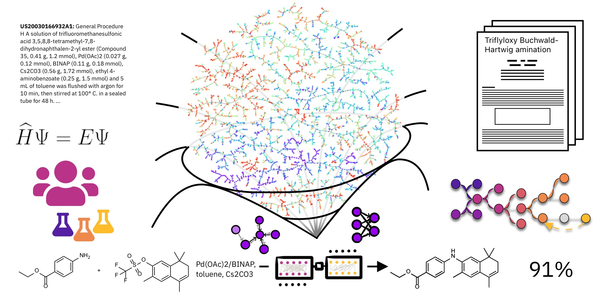

The Laboratory of Artificial Chemical Intelligence (LIAC) is part of the Institute of Chemical Sciences and Engineering at École Polytechnique Fédérale de Lausanne (EPFL), Switzerland. The lab is led by Prof. [Philippe Schwaller](https://people.epfl.ch/philippe.schwaller?lang=en).

At LIAC, we develop artificial intelligence and machine-learning methods for chemical reasoning, synthesis planning, molecular and materials discovery, and experimental optimization. We pursue fundamental science driven by real-world applications, with a particular focus on sustainability.

LIAC is derived from the French laboratory name, *Laboratoire d'intelligence artificielle en chimie*.

## Recent research highlights

- **Synthegy** combines large language models with chemical search tools for strategy-aware synthesis planning and reaction-mechanism elucidation. [Matter (2026)](https://doi.org/10.1016/j.matt.2026.102812)
- **Saturn and TANGO** make generative molecular design more sample-efficient and directly optimize for synthesizability. [Saturn](https://doi.org/10.1038/s42256-026-01200-4) · [TANGO](https://doi.org/10.1038/s43588-026-00959-1)
- **α-PSO** uses interpretable swarm intelligence and machine learning for parallel chemical-reaction optimization. [Chem (2026)](https://doi.org/10.1016/j.chempr.2026.103035)

[See more research highlights](research.qmd).
