

# Principal Investigator

::: {.callout-note .column-page appearance="simple" icon=false}
::: {.grid}
::: {.g-col-12 .g-col-sm-4 .g-col-md-4}

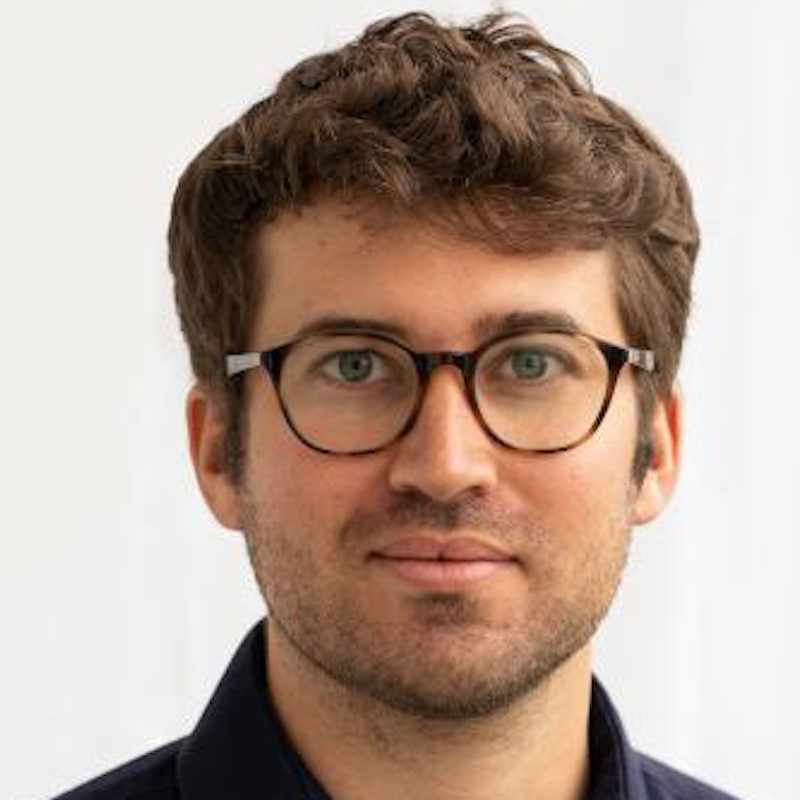{.img-fluid .img-round}

:::

::: {.g-col-12 .g-col-sm-8 .g-col-md-8}
## [Prof. Philippe Schwaller](people/philippe_schwaller.qmd)

Philippe Schwaller joined EPFL in February 2022 and leads the Laboratory of Artificial Chemical Intelligence. LIAC develops artificial intelligence for chemical reasoning, synthesis planning, molecular and materials discovery, and experimental optimization. Philippe is also a core PI of NCCR Catalysis.

- Five years at IBM Research Zürich with Dr. Teodoro Laino
- PhD in Chemistry and Molecular Sciences, University of Bern, 2021
- MPhil in Physics, University of Cambridge, 2019
- BSc and MSc in Materials Science and Engineering, EPFL

[](mailto:philippe.schwaller@epfl.ch) --- [](https://twitter.com/pschwllr) --- [](https://github.com/pschwllr) --- [](https://scholar.google.com/citations?user=Tz0I4ywAAAAJ)

:::
:::
:::

## Postdoctoral Researchers

::: {.grid .column-page}
::: {.g-col-12 .g-col-sm-6 .g-col-md-4}
::: {.callout-note appearance="simple" icon=false}
## Dr. Matthew Hart

- Since September 2025
:::
:::

::: {.g-col-12 .g-col-sm-6 .g-col-md-4}
::: {.callout-note appearance="simple" icon=false}
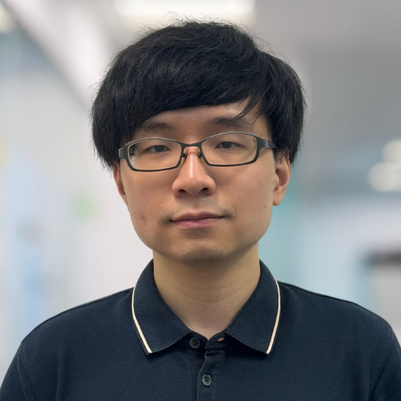{.img-fluid .img-round}

## Dr. Ka Lok (Jacky) Chan

- Since September 2025
- Based in Singapore
- CARES SM3 project
:::
:::

::: {.g-col-12 .g-col-sm-6 .g-col-md-4}
::: {.callout-note appearance="simple" icon=false}
## Dr. Maarten R. Dobbelaere

- Since August 2026
:::
:::

::: {.g-col-12 .g-col-sm-6 .g-col-md-4}
::: {.callout-note appearance="simple" icon=false}
## Dr. Tom Frömbgen

- Since September 2026
:::
:::

::: {.g-col-12 .g-col-sm-6 .g-col-md-4}
::: {.callout-note appearance="simple" icon=false}
## Dr. Gianin Thomann

- Since September 2026
- With Spiez Laboratory
:::
:::
:::

## Administrative Assistant

Annick Gaudin ([](https://mailhide.io/e/3FagEfKd)) — the amazing person who makes sure that everything runs smoothly.

## PhD Students

::: {.grid .column-page}
::: {.g-col-12 .g-col-sm-6 .g-col-md-4}
::: {.callout-note appearance="simple" icon=false}
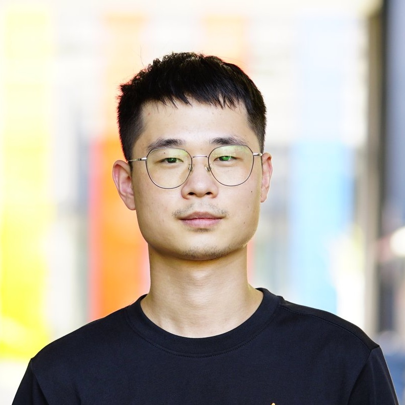{.img-fluid .img-round}

## Junwu Chen

- Since August 2022
:::
:::

::: {.g-col-12 .g-col-sm-6 .g-col-md-4}
::: {.callout-note appearance="simple" icon=false}
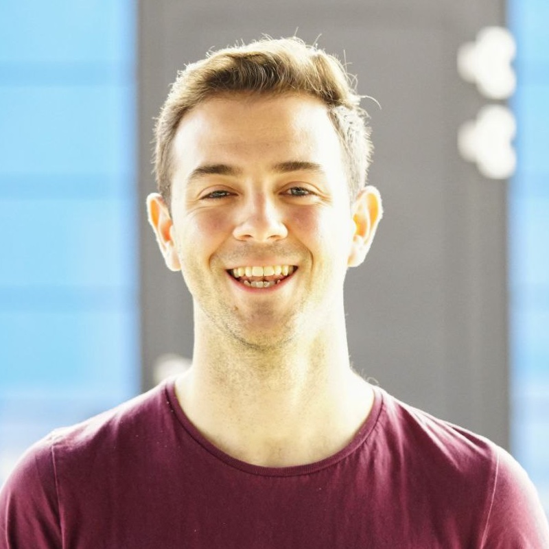{.img-fluid .img-round}

## Víctor Sabanza Gil

- Since October 2022
- Co-supervised by Prof. Jeremy Luterbacher
:::
:::

::: {.g-col-12 .g-col-sm-6 .g-col-md-4}
::: {.callout-note appearance="simple" icon=false}
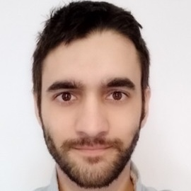{.img-fluid .img-round}

## Paulo Neves

- Since January 2023
- External PhD with Janssen Pharmaceuticals
:::
:::

::: {.g-col-12 .g-col-sm-6 .g-col-md-4}
::: {.callout-note appearance="simple" icon=false}
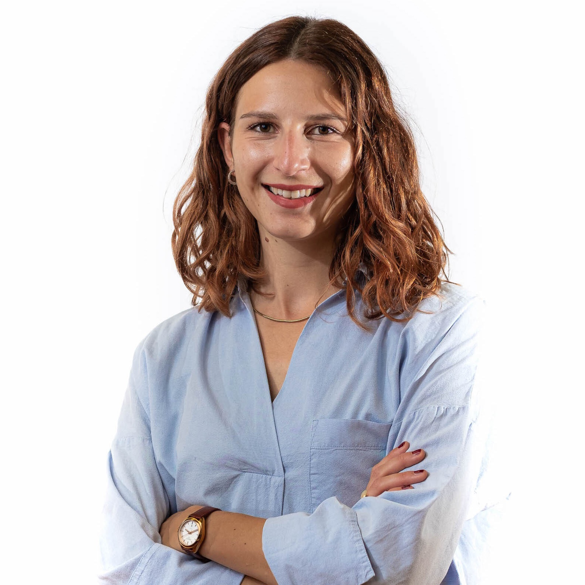{.img-fluid .img-round}

## Rebecca M. Neeser

- Since April 2023
- Co-supervised by Prof. Bruno Correia
:::
:::

::: {.g-col-12 .g-col-sm-6 .g-col-md-4}
::: {.callout-note appearance="simple" icon=false}
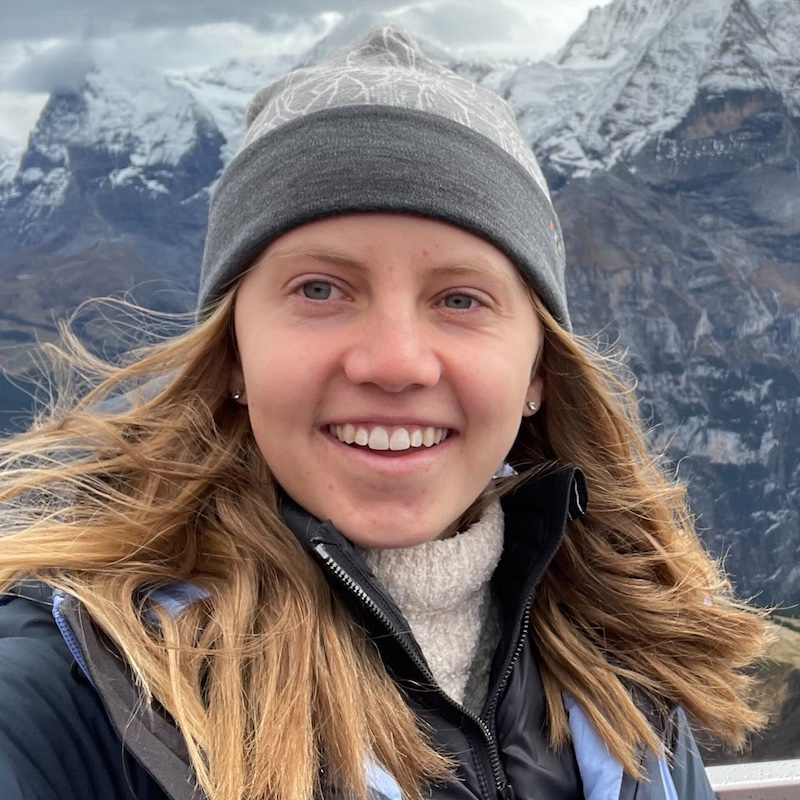{.img-fluid .img-round}

## Sarina N. Kopf

- Since August 2023
- Co-supervised by Prof. Cristina Nevado
:::
:::

::: {.g-col-12 .g-col-sm-6 .g-col-md-4}
::: {.callout-note appearance="simple" icon=false}
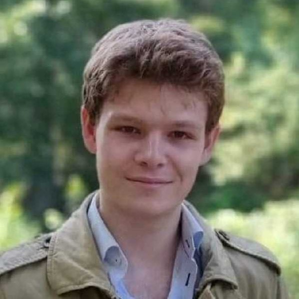{.img-fluid .img-round}

## Daniel P. Armstrong

- Since September 2023
:::
:::

::: {.g-col-12 .g-col-sm-6 .g-col-md-4}
::: {.callout-note appearance="simple" icon=false}
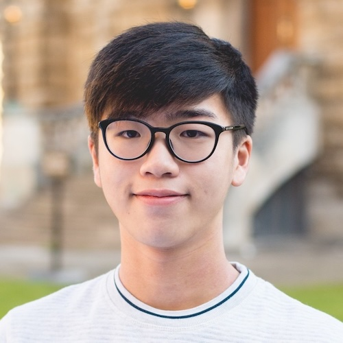{.img-fluid .img-round}

## Wing Pong (Joshua) Sin

- Since October 2023
- External PhD with Roche
:::
:::

::: {.g-col-12 .g-col-sm-6 .g-col-md-4}
::: {.callout-note appearance="simple" icon=false}
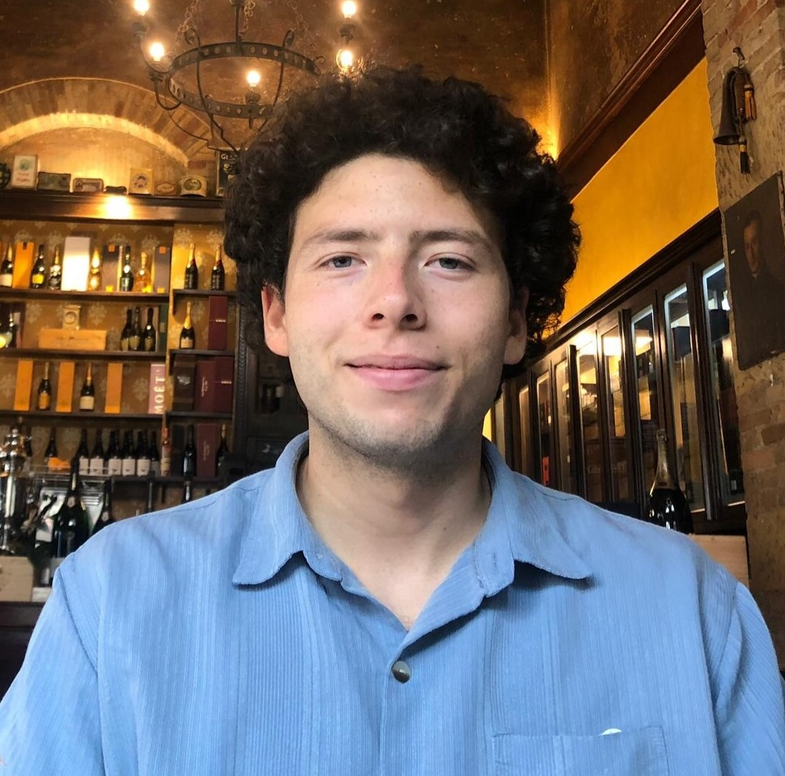{.img-fluid .img-round}

## Sandro Agostini

- Since March 2024
- External PhD with IBM Research
:::
:::

::: {.g-col-12 .g-col-sm-6 .g-col-md-4}
::: {.callout-note appearance="simple" icon=false}
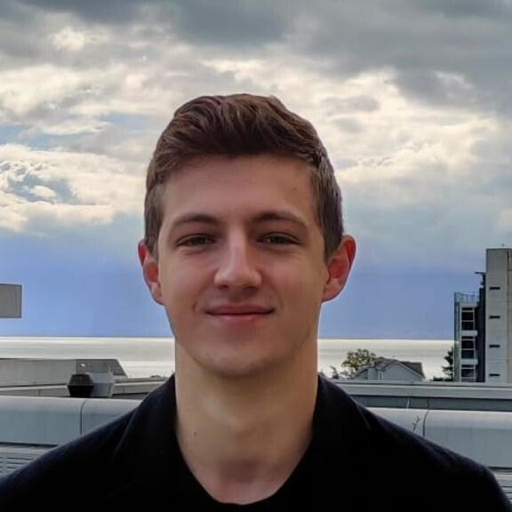{.img-fluid .img-round}

## Théo A. Neukomm

- Since September 2024
:::
:::

::: {.g-col-12 .g-col-sm-6 .g-col-md-4}
::: {.callout-note appearance="simple" icon=false}
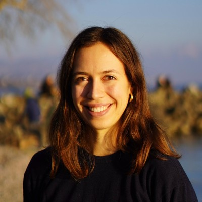{.img-fluid .img-round}

## Salomé M. A. Guilbert

- Since October 2024
- Co-supervised by Prof. Ursula Röthlisberger
:::
:::

::: {.g-col-12 .g-col-sm-6 .g-col-md-4}
::: {.callout-note appearance="simple" icon=false}
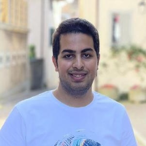{.img-fluid .img-round}

## Amin Mansouri

- Since April 2025
- Co-supervised by Prof. Caglar Gulcehre
:::
:::

::: {.g-col-12 .g-col-sm-6 .g-col-md-4}
::: {.callout-note appearance="simple" icon=false}
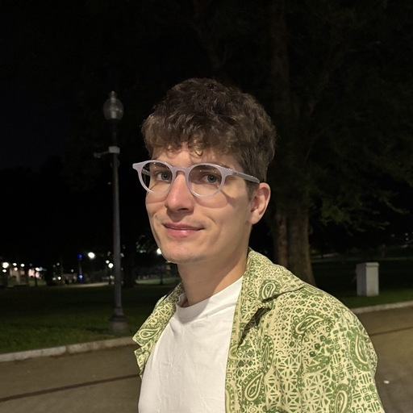{.img-fluid .img-round}

## Bohdan Naida

- Since September 2025
:::
:::

::: {.g-col-12 .g-col-sm-6 .g-col-md-4}
::: {.callout-note appearance="simple" icon=false}
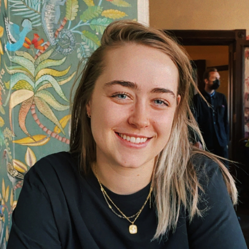{.img-fluid .img-round}

## Cassandra Masschelein

- Since September 2025
:::
:::

::: {.g-col-12 .g-col-sm-6 .g-col-md-4}
::: {.callout-note appearance="simple" icon=false}
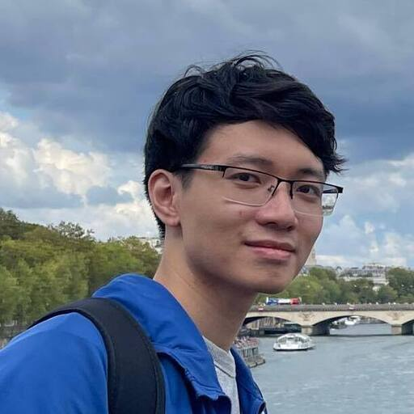{.img-fluid .img-round}

## Vu Nguyen

- Since October 2025
:::
:::

::: {.g-col-12 .g-col-sm-6 .g-col-md-4}
::: {.callout-note appearance="simple" icon=false}
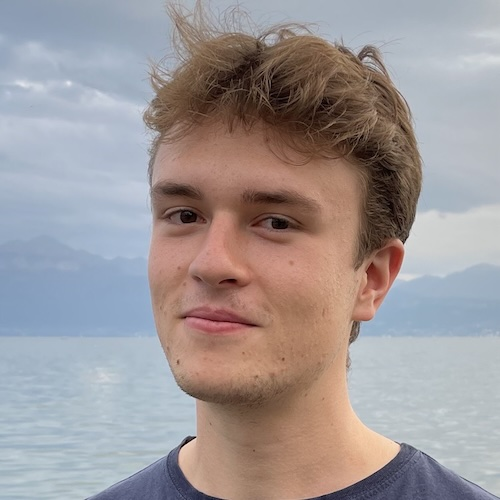{.img-fluid .img-round}

## Rémi Schlama

- Since October 2025
:::
:::

::: {.g-col-12 .g-col-sm-6 .g-col-md-4}
::: {.callout-note appearance="simple" icon=false}
## David Ming Segura

- Since February 2026
:::
:::

::: {.g-col-12 .g-col-sm-6 .g-col-md-4}
::: {.callout-note appearance="simple" icon=false}
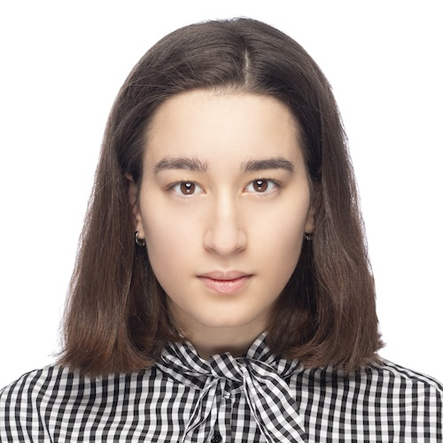{.img-fluid .img-round}

## Anna Kelmanson

- Since February 2026
:::
:::

::: {.g-col-12 .g-col-sm-6 .g-col-md-4}
::: {.callout-note appearance="simple" icon=false}
## Saumya Thakur

- Since February 2026
:::
:::

::: {.g-col-12 .g-col-sm-6 .g-col-md-4}
::: {.callout-note appearance="simple" icon=false}
## Thibaud Southiratn

- Since March 2026
- External PhD with AstraZeneca
:::
:::

::: {.g-col-12 .g-col-sm-6 .g-col-md-4}
::: {.callout-note appearance="simple" icon=false}
## Susanna Di Vita

- Since June 2026
- External PhD with SecureCell
:::
:::

::: {.g-col-12 .g-col-sm-6 .g-col-md-4}
::: {.callout-note appearance="simple" icon=false}
## Gabriel Gibberd

- Since June 2026
:::
:::

::: {.g-col-12 .g-col-sm-6 .g-col-md-4}
::: {.callout-note appearance="simple" icon=false}
## Anabel Yong

- Since August 2026
:::
:::
:::

## Visiting PhD Students

::: {.grid .column-page}
::: {.g-col-12 .g-col-sm-6 .g-col-md-4}
::: {.callout-note appearance="simple" icon=false}
## Luca Ruvo

- Since September 2026
- Vall d'Hebron Institute of Oncology (VHIO)
:::
:::
:::

## Research Engineers

::: {.grid .column-page}
::: {.g-col-12 .g-col-sm-6 .g-col-md-4}
::: {.callout-note appearance="simple" icon=false}
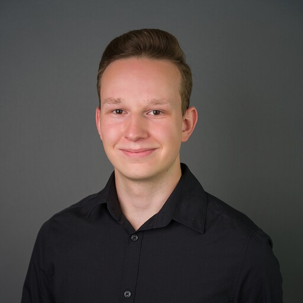{.img-fluid .img-round}

## Jeremy Goumaz

- Shared with Prof. Maria Brbić
- BSc and MSc from EPFL
:::
:::
:::

## Interns

::: {.grid .column-page}
::: {.g-col-12 .g-col-sm-6 .g-col-md-4}
::: {.callout-note appearance="simple" icon=false}
## Aurélie Bechinger
:::
:::

::: {.g-col-12 .g-col-sm-6 .g-col-md-4}
::: {.callout-note appearance="simple" icon=false}
## Diane Tambey
:::
:::

::: {.g-col-12 .g-col-sm-6 .g-col-md-4}
::: {.callout-note appearance="simple" icon=false}
## Artiom Hrynov
:::
:::

::: {.g-col-12 .g-col-sm-6 .g-col-md-4}
::: {.callout-note appearance="simple" icon=false}
## Duc Dat Dang
:::
:::

::: {.g-col-12 .g-col-sm-6 .g-col-md-4}
::: {.callout-note appearance="simple" icon=false}
## Octavian Susanu
:::
:::

::: {.g-col-12 .g-col-sm-6 .g-col-md-4}
::: {.callout-note appearance="simple" icon=false}
## Louis Vasseur
:::
:::

::: {.g-col-12 .g-col-sm-6 .g-col-md-4}
::: {.callout-note appearance="simple" icon=false}
## Gabrielė Strodomskytė
:::
:::

::: {.g-col-12 .g-col-sm-6 .g-col-md-4}
::: {.callout-note appearance="simple" icon=false}
## Marc Al Hachem
:::
:::
:::

# Alumni

## PhD Students

- **Dr. Bojana Ranković**, March 2022–August 2026 — ETH AI Center Postdoctoral Fellow. Thesis: *Language, Likelihood, and the Laboratory: Aligning Language Models with Bayesian Optimization for Experimental Discovery*
- **Dr. Oliver Schilter**, external PhD with IBM Research, April 2022–June 2025 — Senior AI Engineer at Sphere Energy. Thesis: *Integrating AI across the Discovery Cycle — Advancing Sustainable Chemistry through Digital Methods*
- **Dr. Andres M. Bran**, August 2022–June 2026 — Cofounder and CTO of b-12 labs (Y Combinator). Thesis: *Chemistry in Context: Applications of Large Language Models to Synthetic Organic Chemistry and Catalysis*
- **Dr. Jeff Guo**, September 2022–December 2025 — Research Scientist at Isomorphic Labs. Thesis: *Language-based Sample-efficient and Synthesizable Molecular Generative Design*

## Postdocs & Fellows

- **Dr. Stéphane d'Ascoli**, March–October 2023 — Research Scientist at Meta
- **Dr. Geemi Wellawatte**, August 2023–August 2024 — now at Lila Sciences; previously Academic Coordinator at FutureHouse
- **Dr. Zlatko Jončev**, September 2023–August 2025 — Cofounder and CEO of b-12 labs (Y Combinator)
- **Dr. Marta Brucka**, April–September 2024 — Application Scientist at Enantios
- **Dr. Edvin Fako**, February 2025–January 2026 — Elemynt
- **Dr. Julian Götz**, February 2025–March 2026 — OnePot
- **Dr. Sergey Pozdnyakov**, February–December 2025 — Postdoc at Microsoft
- **Dr. Jan Rittig**, June 2025–May 2026 — Cofounder of aChEntic

## Visiting Doctoral Students

- Matthew Hart — University of North Carolina at Chapel Hill
- Juliette Fenogli — ENS–PSL
- Rostislav Fedorov — Heidelberg Institute for Theoretical Studies (HITS)
- Matt Ball — University of Strasbourg
- Eric Alcaide — Università della Svizzera italiana (USI)
- Oliver Loveday — Institute of Chemical Research of Catalonia (ICIQ)
- Nicholas Runcie — University of Oxford
- Ryo Kuroki — Asahi Kasei

## Visiting Postdoctoral Researchers

- Dr. Maarten R. Dobbelaere — Ghent University, before joining LIAC as a postdoc
- Dr. Adem R. N. Aouichaoui — Technical University of Denmark (DTU)

## Master's Theses

### 2022/23 (2 theses)

- Cheng-Hua Huang — EPFL
- Artur Andrzej Stefaniuk — EPFL

### 2023/24 (3 theses)

- Lucien Michel Gérard Brey — MIT
- Amin Abdelrafour Debabeche — MIT
- Théo Alain Neukomm — Carnegie Mellon University

### 2024/25 (4 theses)

- Cesar Antonio Doñez Miranda — Empa
- Rémi Michel Maxime Schlama — ETH Zurich
- David Ming Segura — EPFL
- Yunjie Xu — ETH Zurich

### 2025/26 (4 theses)

- Tim Arni — Mila
- Miquel Angel Perez Puigdomenech — EPFL
- Luca Rota — ETH Zurich
- Milena Charlotte Wiegand — Technical University of Munich

Master's theses listing an external institution were carried out under Prof. Schwaller's supervision at EPFL, with the degree awarded by the student's home institution.

## Master Semester Projects (EPFL)

### 2022/23 (3 projects)

- Lucien Michel Gérard Brey
- Malte Franke
- Théo Alain Neukomm

### 2023/24 (7 projects)

- Jenestin Anton Anthonipillai
- Ziad El Malki
- Tugdual Marc-Emmanuel Pierre Marie Kerjan
- Colleen Rachèle Lonfat
- Théo Alain Neukomm
- Rémi Michel Maxime Schlama — two projects

### 2024/25 (7 projects)

- Arne Beckmann — two projects
- Ziad El Malki
- Aleksei Kudrinskii
- Guillaume Romain Galaad Malherbe
- Marko Simic
- Ines Bouchama

### 2025/26 (10 projects)

- Sathvik Bhagavan
- Malo Gfeller
- Zeineb Mellouli
- Cédric Nathanaël Rossboth
- Octavian Susanu
- Matéo Tatzber — two projects
- Anthony David Verhoeven
- Nicholas Jeffrey Weiss
- Zongmin Zhang

## Visiting Project Students

### 2022–26 (20 projects)

- Xu Huang — Shanghai Jiao Tong University; now PhD student at UC Berkeley
- Tanya Gupta — IIT Delhi; now Associate at Strategy&
- Anna Kelmanson — TCCM; now PhD student at EPFL
- Anna Kapeliukha — Taras Shevchenko National University of Kyiv; now Head of AI & Cheminformatics at Chemspace
- Franziska Weissbach — Technical University of Berlin; now PhD student at ETH Zürich
- Melih Gökay Yiğit — Middle East Technical University
- Shaipranesh Sentilkumar — BITS Pilani; now PhD student at Mila
- Huixuan Guo — Nanyang Technological University; now PhD student at MIT
- Yedong Xie — University of Science and Technology of China
- Ximena Leyva Peralta — Yale University
- Yifan Du — Zhejiang University; now PhD student at UCLA
- Magdalena Lederbauer — ETH Zürich; now PhD student at MIT
- Sacha Raffaud — Imperial College London
- Manuel Ott — ETH Zürich
- Orkhan Abdullayev — University of Strasbourg
- Duc Dat Dang — VinUniversity
- Diogo Torres — NOVA University Lisbon
- Alexandre Lohest — University of Strasbourg
- Jonathan Tubb — Stanford University
- Alex Oarga — University of Barcelona

## Other Former Interns

- Nichelle Sequeira, Victoire Lang, and Peri Yerlikaya.
